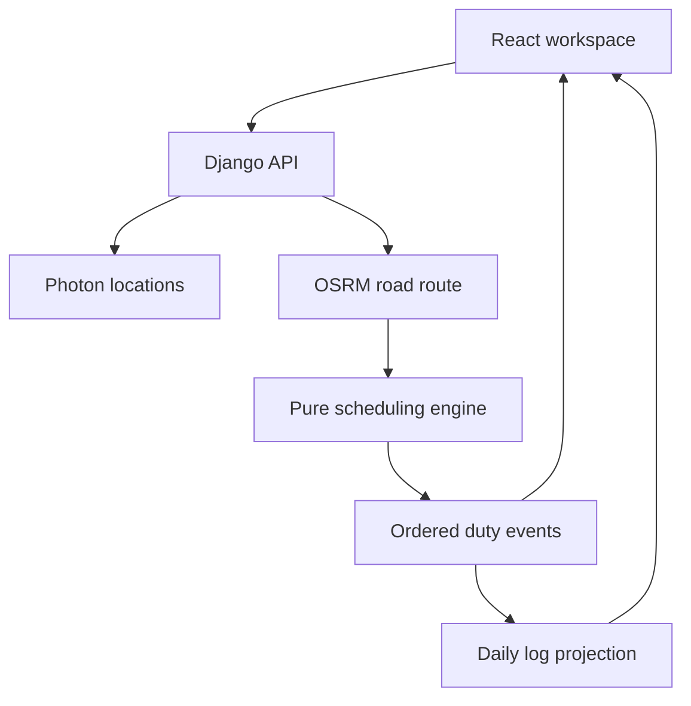

# Architecture and decisions

## Request flow



The browser never calculates legal driving availability. Django produces a single event sequence. The map, itinerary, summary and graphs all read that sequence, which prevents independent views from disagreeing.

## Scheduling model

`Place` carries a label and coordinates. A `Leg` has road geometry, miles and a travel estimate. There are exactly two legs. OSRM duration is increased if necessary so the average road speed does not exceed the disclosed 55 mph estimate.

All clocks use integer seconds. Initial cycle hours round upward to the next second. Distance remains floating-point miles and is conserved across driving events. A geometry cumulative-length index supports interpolating each stop along the route with binary search.

The scheduler tracks:

| State               | Meaning                                                     | Reset                             |
| ------------------- | ----------------------------------------------------------- | --------------------------------- |
| Daily driving       | Driving since the last qualifying rest                      | 10-hour rest or 34-hour restart   |
| Shift start         | Beginning of the 14-hour driving window                     | 10-hour rest or 34-hour restart   |
| Driving since break | Cumulative driving since 30 consecutive non-driving minutes | Qualifying break, service or rest |
| Cycle used          | Prior used hours plus new driving and on-duty work          | 34-hour restart                   |
| Miles since fuel    | Cumulative distance across both legs                        | Fuel stop                         |

For each driving piece, advance to the earliest of the leg end, driving limit, break threshold, cycle limit, shift-window limit or fuel limit. Add the required stop, then reevaluate. A cycle restart takes precedence over daily rest because it satisfies both. Fueling takes precedence over a separate driving break because its 30 non-driving minutes satisfy the break too. Pickup and delivery can also satisfy the interruption requirement.

At the pickup and dropoff, add one hour on duty. The planner conservatively restarts before any service that would exceed 70 hours of on-duty work. It may finish non-driving service after the 14-hour window; it does not drive again until rested.

No rolling eight-day history is fabricated. With only the supplied cycle-used scalar, a 34-hour restart is a predictable conservative policy. An extension could accept eight daily totals and recapture actual hours at the correct boundary.

## Daily logs

Events carry ISO start/end timestamps in the selected fixed home-terminal offset. `daily_logs` intersects each event with each local calendar day. It apportions mileage by driving duration and fills the unused first/last-day portions as explicitly assumed off duty.

Every sheet's status durations sum to exactly 86,400 seconds. Crossing midnight alone never resets a driving clock. The SVG maps seconds horizontally and the four duty statuses vertically, connecting adjacent transitions. Totals include seconds when necessary instead of rounding four independent values into a misleading 24-hour total. Summary cards use rounded minutes for readability.

The log includes date, driver, carrier, vehicle, trip endpoints, mileage, shipping reference, terminal and remarks. Missing optional metadata is labelled “Not provided.” The signature remains blank. Print CSS includes every sheet and starts each daily record on a new page. Very dense remark tables may continue onto another physical page. Verified print cases include four-day restarts, midnight service and maximum-length metadata.

## Provider isolation

- Photon searches only when the user explicitly requests it. Results include selected coordinates; arbitrary typed text cannot silently become a route location.
- OSRM is called once for the ordered three-waypoint trip. Full step geometries produce separate road legs and instructions.
- A bounded in-process cache holds at most 128 provider responses for 15 minutes. It is opportunistic across warm requests, not persistent serverless storage.
- Optional reverse lookups resolve at most eight unique roadside points per trip, with two concurrent requests and a three-second per-request timeout. A missing city/state label retains the exact planning coordinates. Enrichment never changes timing or location.
- Route and search errors return visible 503 errors. A failed route returns an error rather than an estimated replacement.
- Public providers are suitable for a limited assessment demo. Sustained traffic needs contracted or self-hosted providers, shared caching and deployment rate limits.

## API contract

| Method | Path                       | Input                 | Output                                    |
| ------ | -------------------------- | --------------------- | ----------------------------------------- |
| GET    | `/api/health`              | None                  | Django health status                      |
| GET    | `/api/locations?q=Chicago` | 2–150 character query | Selected-place candidates                 |
| POST   | `/api/plan`                | JSON below            | Route, events, summary, logs, assumptions |

```json
{
  "current": { "label": "Chicago, Illinois", "lat": 41.8781, "lon": -87.6298 },
  "pickup": { "label": "Springfield, Illinois", "lat": 39.7817, "lon": -89.6501 },
  "dropoff": { "label": "Nashville, Tennessee", "lat": 36.1627, "lon": -86.7816 },
  "cycle_used": 0,
  "departure": "2026-09-15T06:00",
  "utc_offset_minutes": -360,
  "driver_details": { "driver": "", "carrier": "", "vehicle": "", "shipping": "", "office": "" }
}
```

The request limit is 32 KiB. Inputs reject booleans as numbers, NaN/infinity, out-of-range values, unselected places, invalid dates and oversized text. The supported location bounding box covers the contiguous US. Coordinates inside the rectangle still require a successful road route. No database, sessions or cookies are used. Consequently the public JSON calculation endpoint has no session-authenticated state to protect with CSRF tokens. API trip responses use `Cache-Control: no-store`.

## Vercel layout

Vite builds static files into `frontend/dist`. Three file-based Python functions import the same Django WSGI application. Each adapter sets its fixed route path before dispatch. Tests exercise these exports directly, including JSON POST bodies and method errors.

`framework: null` selects the explicit static-plus-functions layout rather than a Django preset that would route the entire application to Python. No catch-all rewrite is required. Python 3.12 is pinned and runtime requirements are small. Test/reference/frontend files are excluded from function bundles. Vercel built and served this layout successfully on 14 September 2026. It detected Vite while retaining the explicit frontend output and all three Python functions. Public routing and live browser requests passed.

## Deliberate tradeoffs

| Choice                  | Benefit                               | Practical limit                                    |
| ----------------------- | ------------------------------------- | -------------------------------------------------- |
| Deterministic engine    | Explainable, reproducible rule checks | Does not optimize all legal schedules              |
| Stateless backend       | Simple serverless deployment          | No saved trips or historical recap                 |
| Fixed terminal offset   | Consistent 24-hour paper sheets       | No automatic DST transitions                       |
| Generic road routing    | No paid key required for the demo     | No truck-specific restrictions                     |
| Proposed roadside stops | Route-aligned planning points         | Facilities must be selected/verified separately    |
| Client print sheets     | All records can be saved as PDF       | Final pagination depends on browser print settings |
